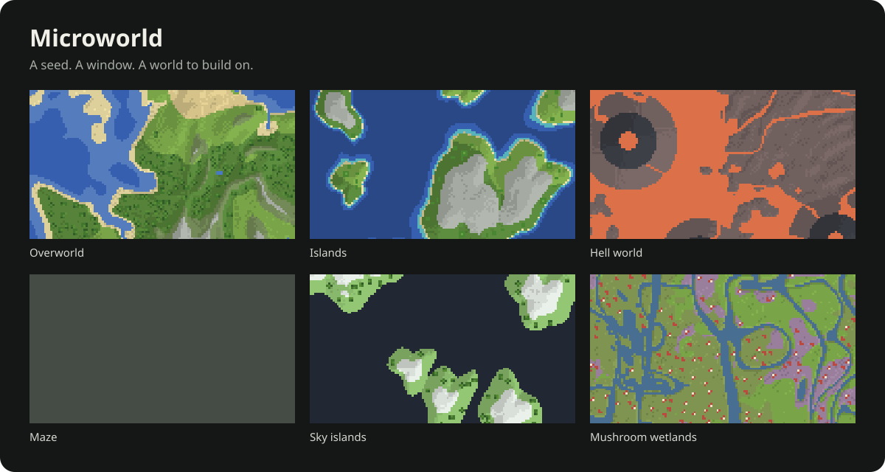

# Microworld

A seed, a window, a world to build on.

Microworld generates deterministic 2D world data for games. Request any patch of terrain and get elevation, biomes, objects, structure tiles, and a walking mask as JSON. Your game decides how they look and what happens next.



[Explore the site](https://microworld.kaf.sh) · [API reference](docs/api-contract.md) · [Contribute](CONTRIBUTING.md)

## Your first world

```sh
curl -X QUERY https://microworld.kaf.sh/api/world \
  -H 'Content-Type: application/json' \
  -d '{"generatorVersion":"1","seed":"a-small-adventure"}'
```

No account. No API key. Change the seed for a new world, or move the window to explore more of the same one.

Start with a small patch, then request more as your player explores. The [API reference](docs/api-contract.md) explains how to choose a window and read the result.

## Pick a starting point

| Preset        | World                                       |
| ------------- | ------------------------------------------- |
| `overworld`   | Continents, forests, deserts, and mountains |
| `chess`       | An endless alternating board                |
| `rpg`         | Broad terrain with towns and ruins          |
| `hell`        | Lava, ash, and basalt                       |
| `islands`     | Scattered land and sandy shores             |
| `sky-islands` | Floating meadows surrounded by void         |
| `ocean`       | Deep water, reefs, and rare islands         |
| `arena`       | Repeating arenas with shared entrances      |
| `maze`        | Connected region mazes                      |
| `moon`        | Craters and mineral deposits                |
| `wetlands`    | Marshes and mushroom groves                 |

Inspect a preset at `/api/presets/{id}`, then override its terrain, biome definitions, placement rules, or tile templates. Rules can control rarity, spacing, footprints, slope, and proximity to water.

## Keep exploring

The interactive site demos start with bundled worlds. Pan, zoom, inspect cells, switch layers, and generate a new seed when you want another map.

Pin the generator version and save the resolved configuration to reproduce a world. Overlapping requests agree, including structures that cross chunk boundaries. Microworld generates initial world data; your game stores cut trees, buildings, and moved pieces.

A stateless MCP endpoint at `/mcp` targets **MCP 2026-07-28**, with `list_presets`, `get_preset`, and `generate_world` tools. See the [MCP request example](docs/api-contract.md#mcp) for the required headers and metadata. Clients must support that protocol revision.

## Open source

[Apache-2.0](LICENSE). Built by [Kaf](https://github.com/iamkaf).

[Contribution guide](CONTRIBUTING.md) · [Security policy](SECURITY.md) · [Architecture and generation model](docs/implementation-brief.md)
