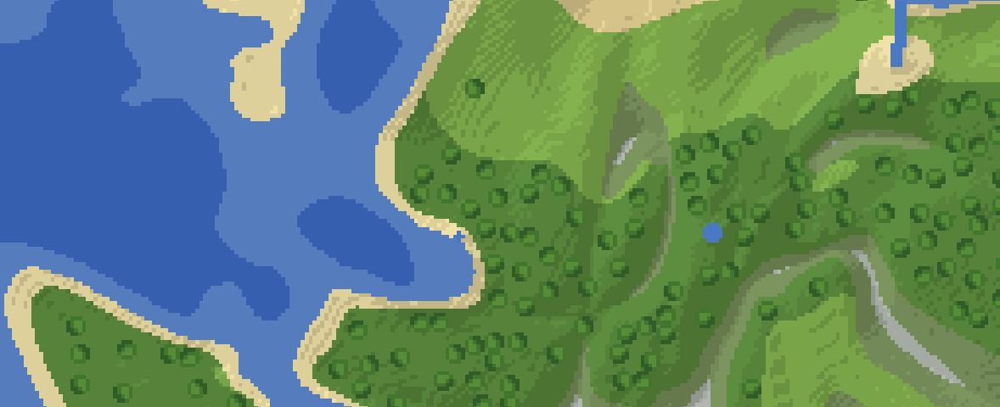
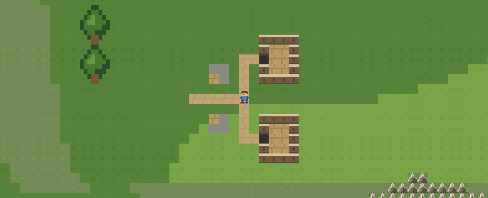

# Visual generation review

The target is Minecraft, 2D and top-down. A second Classic RPG renderer takes cues from older Final Fantasy games. Both use the actual generated data and remain on generator/schema v1.

## References

[Final Fantasy I, NES overworld](https://fantasyanime.com/finalfantasy/ff/ffshots01.htm) separates open ground, forest edges, water, and destinations with clear tile shapes.

[Final Fantasy IV, town map](https://crakthesky.wordpress.com/2018/08/20/load-state-1-final-fantasy-iv/) uses paths, bridges, buildings, and trees to define movement at character scale.

These screenshots are references only. The project uses its own small tile patterns and character sprite.

## Generated results

The original preview had broad, smooth color patches and single-pixel objects. The revised generator has stepped elevation, mountain ridges, separate island masses, river valleys, and actual canopy templates. Presets also have distinct volcanic, cratered, and wetland terrain.

Classic RPG renders terrain as small tiles with shoreline edges and mountain silhouettes. Settlements have linked roads and open doorways. The character uses the same `walkable` array returned by the API. Buildings have placement priority over vegetation.

## Verification

- Visually inspected 18 generated windows across six terrain presets and three seeds, as well as both renderers in the playground.
- Checked character movement and mobile directional controls at 390 × 844 with no page overflow.
- Tested all 11 presets at 256 × 256 across three seeds.
- Tested elevation, biome, and collision agreement between overlapping windows at ordinary coordinates, `2^48`, and the world boundary.

Drainage uses a bounded downhill graph, not a full hydrology simulation. Walking currently covers the requested window. This is terrain and movement scaffolding; combat, quests, persistent state, and world streaming belong to the game built on it.
